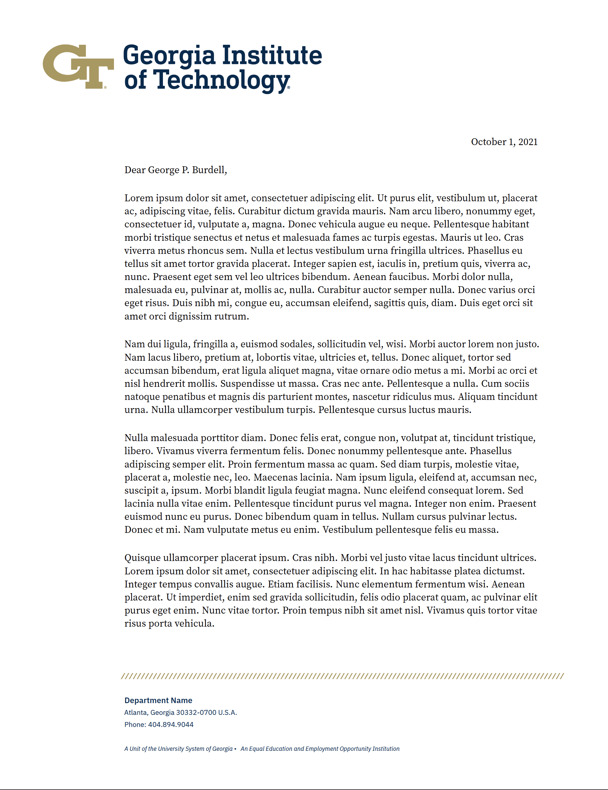
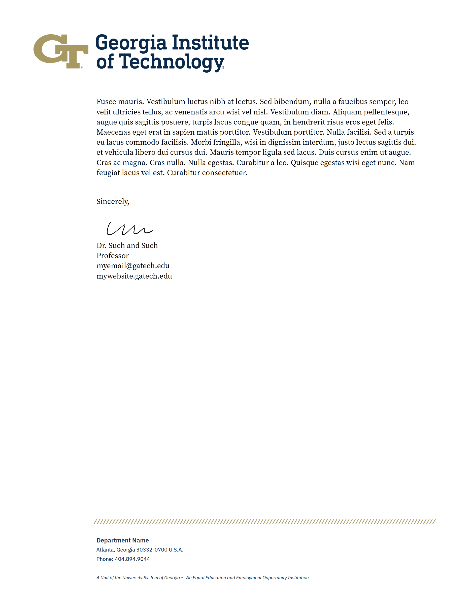

# Georgia Tech Letterhead in LaTeX

This is a reproduction of the Georgia Tech letterhead in Latex.
It uses the new GT [branding](https://brand.gatech.edu/) (per Oct 1, 2021) and [replicates this document](https://brand.gatech.edu/brand-assets/letterhead).
I used the free typeface alternatives [suggested by the styleguide](https://brand.gatech.edu/our-look/typography).

## How to use

Copy `gt-letterhead.sty`, `template.tex`, and `assets/` to your working directory.
You will need `sig.png` or some other signature image if you want to use one.
Modify `template.tex` as appropriate and build with `pdflatex`.

## Logo options

I provide an argument to `gt-letterhead.sty` for using different CoC college and school header logos.
The default is the Georgia Tech logo (no school affiliation). 
You can use others like this

```
% Logo Options: gt, coc, cse, cs, ic, scp
\usepackage[cse]{gt-letterhead}
```

You still have to set the footer text yourself like this
```
\fromdept{College of Computing}
```
because the department guidelines are unclear on if you should specify the college or school.

## What it looks like

[Full PDF](template.pdf)



## Acknowledgement

The skeleton of `gt-letterhead.sty` was copied from [Luke Olson's reproduction](https://github.com/lukeolson/illinois-letterhead) of the University of Illinois at Urbana-Champaign letterhead, though little of the original remains.

## License

MIT
